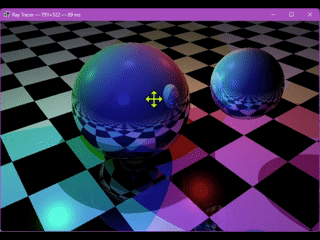

# RayTracer real-time, interactive

A small ray tracer in C# / .NET 10, turned into a **real-time, interactive** viewer: orbit the scene with the mouse, zoom, pan, and watch the little sphere bounce continuously. Cross-platform (Linux / Windows / macOS) thanks to [Raylib-cs](https://github.com/raylib-cs/raylib-cs) for the window and framebuffer.



## Where this project comes from

It all started from the brilliant [LINQ-raytracer by Luke Hoban](https://github.com/lukehoban/LINQ-raytracer), a ray tracer written as a single LINQ query. That demo **blew my mind for years**: seeing an entire 3D scene emerge from a `from … where … select` is one of those things that durably changes how you look at a language.

A huge **thank you to Luke Hoban**. His code has been an enduring source of inspiration to me, a reminder of what sheer expressive elegance can produce.

## What this fork adds

The original tracer renders a single still image in a few seconds. The goal here was the opposite: **interact with the scene while it renders**. It was all done with [Claude Code](https://claude.com/claude-code) in **"doodle" mode**, small, fast iterations, sketching ideas out loud, trying things, tweaking, with the agent bridging idea and code.

The main building blocks:

- **Interactive orbit camera** - left-click-drag to rotate around the scene, wheel to zoom.
- **Camera pan** - right-click-drag to slide the point of interest.
- **Cross-platform host** - the framebuffer is uploaded to a GPU texture each frame via Raylib-cs; `Parallel.For` ray-traces the rows.
- **Allocation-free engine** - rays are structs, scene objects a tagged struct switched on (no per-ray heap churn), `System.Numerics.Vector3` SIMD throughout.
- **Continuous animation** - the small sphere bounces in a loop, independently of user input.

## Running it

```sh
dotnet run -c Release
```

Requirements: .NET 10 SDK. The window and framebuffer go through Raylib-cs, which ships the native binaries via NuGet, so it runs on Linux, Windows and macOS out of the box (on Linux a desktop OpenGL stack — `libGL`, X11/Wayland — is enough).

## Controls

| Action          | Gesture                  |
|-----------------|--------------------------|
| Orbit camera    | left-click + drag        |
| Pan camera      | right-click + drag       |
| Zoom            | mouse wheel              |

## Credits

- **Original code**: [Luke Hoban - LINQ-raytracer](https://github.com/lukehoban/LINQ-raytracer)
- **Real-time makeover**: doodled with Claude Code
